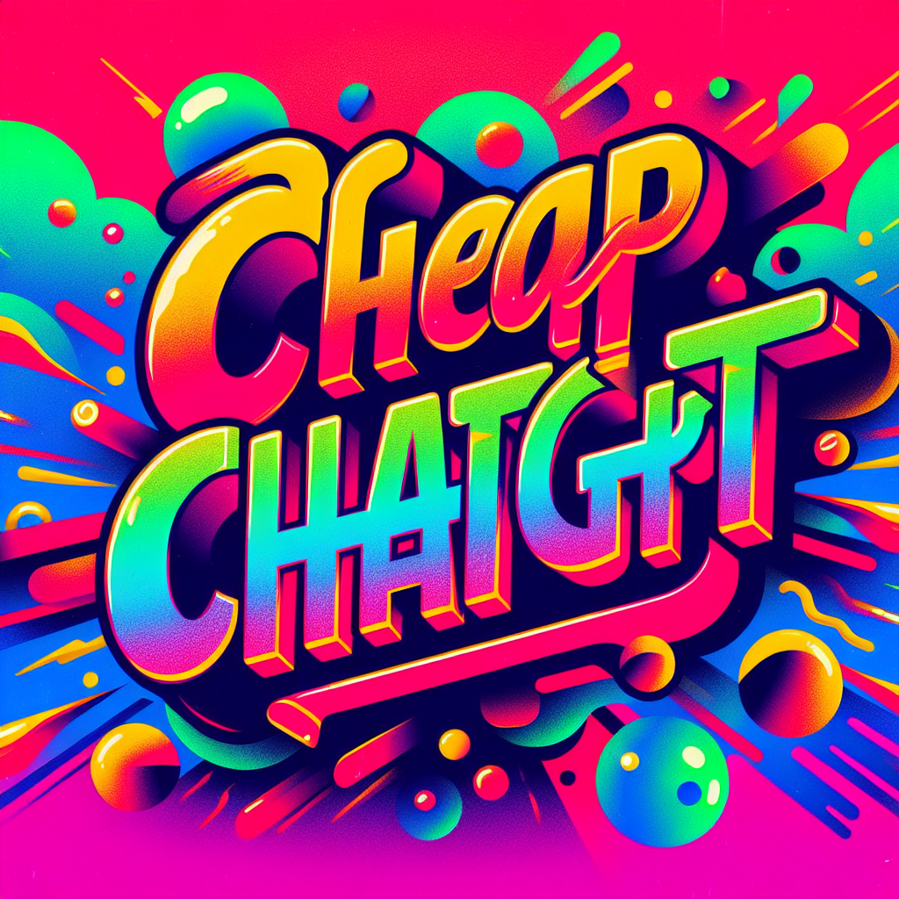

# CheapGPT Discord Bot



CheapGPT Bot is a Discord bot designed to provide a cost-effective alternative to the OpenAI ChatGPT Plus subscription. Instead of a flat $20 per month fee, CheapGPT Bot operates on a pay-as-you-use model, allowing users to access the OpenAI API directly from Discord.

## Features

- **OpenAI API Access**: CheapGPT Bot allows users to interact with the OpenAI API directly from Discord. This includes generating text, answering questions, and more.
- **Pay-as-you-use**: Unlike the OpenAI ChatGPT Plus subscription, CheapGPT Bot charges users only for the API calls they make. This can be a more cost-effective solution for users who don't need constant access to the API.
- **Easy to Use**: CheapGPT Bot is designed to be user-friendly. Users can make API calls directly from the Discord chat, without needing to write any code.

## Commands

- `$ping`: Tests if the bot is working. The bot should respond with 'pong'.
- `$draw <content>`: Generates an image from the provided text using the OpenAI API.

## Setup

1. Clone the repository.
2. Install the required Python packages using pip: `pip install -r requirements.txt`.
3. Create a `.env` file in the root directory and add your OpenAI API key and Discord token:
    ```
    OPENAI_API_KEY=<your-openai-api-key>
    DISCORD_TOKEN=<your-discord-token>
    ```
4. Run `main.py` to start the bot: `python main.py`.

## TODO

- Add text session that allow the user to talk with differnt text based chat models exp GPT4.0 or GPT3.5
- Add role checking so only people with a role can use the chatbot
- DataBase and subscription model

## Contributing

Contributions are welcome! Please read the [contributing guidelines](CONTRIBUTING.md) before getting started.

## License

This project is licensed under the terms of the MIT license. See the [LICENSE](LICENSE) file for details.
